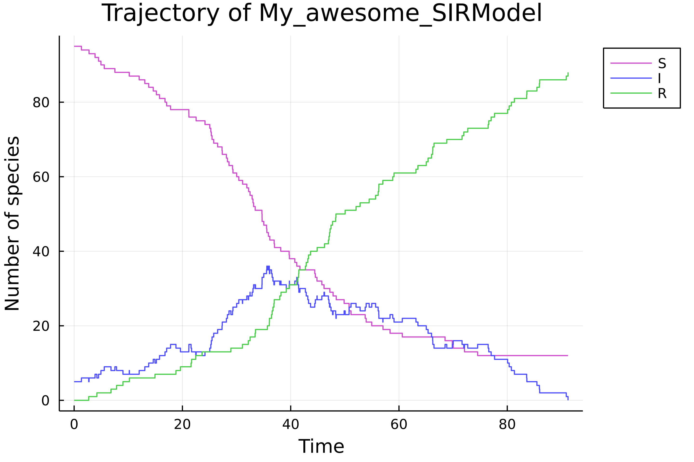

# Create a model

The package offers different ways to create models based on CRNs.

## Load a pre-written model

A bunch of models are already writtne within the package. If `str_model::String` is the name of an implemented model, then `load_model(str_model)` creates a variable with name `str_model`.

```julia
load_model("poisson")
```

Available models are listed below.

## Define a Chemical Reaction Network

Let's consider the Chemical Reaction Network of the SIR model:

``
Infection: S + I \xrightarrow{k_i} 2I \\
Recovery: I \xrightarrow{k_r} R
``

The macro `@network_model` creates easily a CTMC stored in a `ContinuousTimeModel` variable based on this formalism.

```julia
julia> easy_sir = @network_model begin
       Infection: (S + I => 2I, ki*I*S)
       Recovery: (I => R, kr*I)
       end "My awesome SIR"
My_awesome_SIRModel <: ContinuousTimeModel model
- variables :
* I (index = 2 in state space)
* R (index = 3 in state space)
* S (index = 1 in state space)
- parameters :
* ki (index = 1 in parameter space)
* kr (index = 2 in parameter space)
- transitions : Infection,Recovery
- observed variables :
* S (index = 1 in observed state space, index = 1 in state space)
* I (index = 2 in observed state space, index = 2 in state space)
* R (index = 3 in observed state space, index = 3 in state space)
p = [0.0, 0.0]
x0 = [0, 0, 0]
t0 = 0.0
time bound = Inf
```

In the first reaction, `ki*I*S` is the reaction rate of the reaction `Infection`. This model is almost ready to use, we have to set the initial state and the parameters.

```julia
julia> set_param!(easy_sir, [0.0012, 0.05])
       set_x0!(easy_sir, [95, 5, 0])
       σ = simulate(easy_sir)
       load_plots()
       plot(σ)
```




## Manually (advanced)

This page is intented to advanced uses of the package, in order to use

### Based on an existing model


### From scratch

When the above cases don't fit your application one can create manually a `ContinuousTimeModel`. Let's take a look about the signature of the constructor method:

```julia
function ContinuousTimeModel(dim_state::Int, dim_params::Int, map_var_idx::Dict{VariableModel,Int}, 
                             map_param_idx::Dict{ParameterModel,Int}, transitions::Vector{<:Transition},
                             p::Vector{Float64}, x0::Vector{Int}, t0::Float64, 
                             f!::Function, isabsorbing::Function; kwargs)
```

Let's construct an SIR model manually. First, one has to specify the dimensions of the state space and the parameter space.

```julia
dim_state_sir, dim_params_sir = 3, 2
```

`map_var_idx` is a dictionary that maps each model variable (represented by a `Symbol`) to an index in the state space.

```julia
map_var_idx_sir = Dict(:S => 1, :I => 2, :R => 3)
```

`map_var_params` is the equivalent of `map_var_idx` for parameters.

```julia
map_params_idx_sir = Dict(:ki => 1, :kr => 2)
```

`transitions` are the transitions/reactions of the model (vector of `Symbol`), `p`, `x0` and `t0` are respectively the parameters, the initial state and initial time of the model.

```julia
transitions_sir = [:Infection, :Recovery]
p_sir = [0.0012, 0.05]
x0_sir = [95, 5, 0]
t0_sir = 0.0
```

The two last arguments are functions, the first one, called `f!` must have the signature:

```julia
function f!(xnplus1::Vector{Int}, ptr_t::Vector{Float64}, ptr_tr::Vector{Transition},
            xn::Vector{Int}, tn::Float64, p::Vector{Float64})
```

It should return nothing. `xnplus1`, `ptr_t` and `ptr_tr` are vectors where the next values are stored. `ptr_t` is of length 1 and stores the next time value (`ptr_t[1] = tn + delta_t`) whereas `ptr_tr` stores the name of the next transition/reaction (`ptr_tr[1] = :Infection` for example). This function is implemented in the package as:

```julia
@everywhere function sir_f!(xnplus1::Vector{Int}, l_t::Vector{Float64}, l_tr::Vector{Transition},
                             xn::Vector{Int}, tn::Float64, p::Vector{Float64})
    @inbounds a1 = p[1] * xn[1] * xn[2]
    @inbounds a2 = p[2] * xn[2]
    l_a = (a1, a2)
    asum = sum(l_a)
    if asum == 0.0
        copyto!(xnplus1, xn)
        return nothing
    end
    nu_1 = (-1, 1, 0)
    nu_2 = (0, -1, 1)
    l_nu = (nu_1, nu_2)
    l_str_R = (:Infection, :Recovery)

    u1 = rand()
    u2 = rand()
    tau = - log(u1) / asum
    b_inf = 0.0
    b_sup = a1
    reaction = 0
    for i = 1:2 
        if b_inf < asum*u2 < b_sup
            reaction = i
            break
        end
        @inbounds b_inf += l_a[i]
        @inbounds b_sup += l_a[i+1]
    end
 
    nu = l_nu[reaction]
    for i = 1:3
        @inbounds xnplus1[i] = xn[i]+nu[i]
    end
    @inbounds l_t[1] = tn + tau
    @inbounds l_tr[1] = l_str_R[reaction]
end
```
i
The second function called `isaborbing` must have the signature:

```julia
isabsorbing(p::Vector{Float64}, xn::Vector{Int})
```

This function checks if the state `xn` is an absorbing state according to the model parametrised by `p`. It has to return true or false.

For a CTMC, a state is an absorbing state if the total exit rate is zero. In the case of the SIR model;

```julia
@everywhere sir_isabsorbing(p::Vector{Float64}, xn::Vector{Int}) = (p[1]*xn[1]*xn[2] + p[2]*xn[2]) === 0.0
```

Finally one sets the observed variables and the model can be created. The following lines creates a new type `TryhardSIRModel <: ContinuousTimeModel`, and the core of simulation.

```julia
g_sir = [:I]

# Generates simulate method for the new model
@everywhere @eval $(BiochemNetABC.generate_code_model_type_def(:TryhardSIRModel))
@everywhere @eval $(BiochemNetABC.generate_code_model_type_constructor(:TryhardSIRModel))
@everywhere @eval $(BiochemNetABC.generate_code_simulation(:TryhardSIRModel, :sir_f!, :sir_isabsorbing))

tryhard_sir = TryhardSIRModel(dim_state_sir, dim_params_sir, 
                              map_var_idx_sir, map_params_idx_sir, 
                              transitions_sir, p_sir, x0_sir, t0_sir, 
                              :sir_f!, :sir_isabsorbing; g = g_sir)
σ = simulate(tryhard_sir)
```

## List of pre-written models

- `load_model("poisson")`: Poisson process
- `load_model("ER")`: Michaelis-Menten kinetics (Enzymatic Reactions)
- `load_model("SIR")`: Susceptible-Infected-Removed
- `load_model("doping_3way_oscillator")`: Three-way oscillator with doping reactions
- `load_model("repressilator")`: A repressilator model
 
